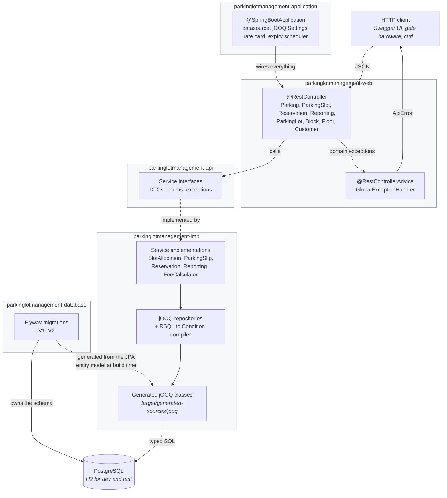
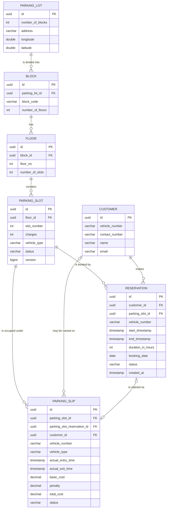
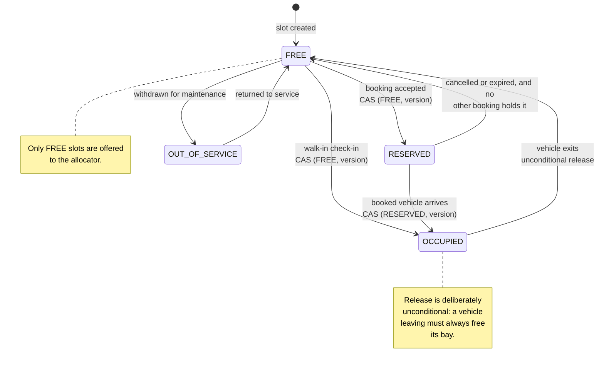
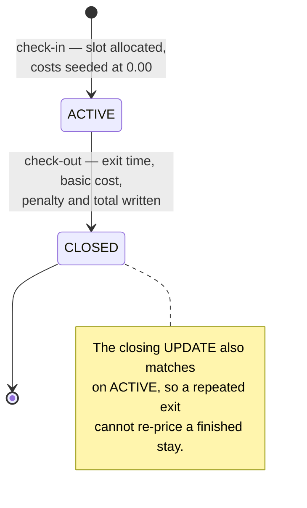
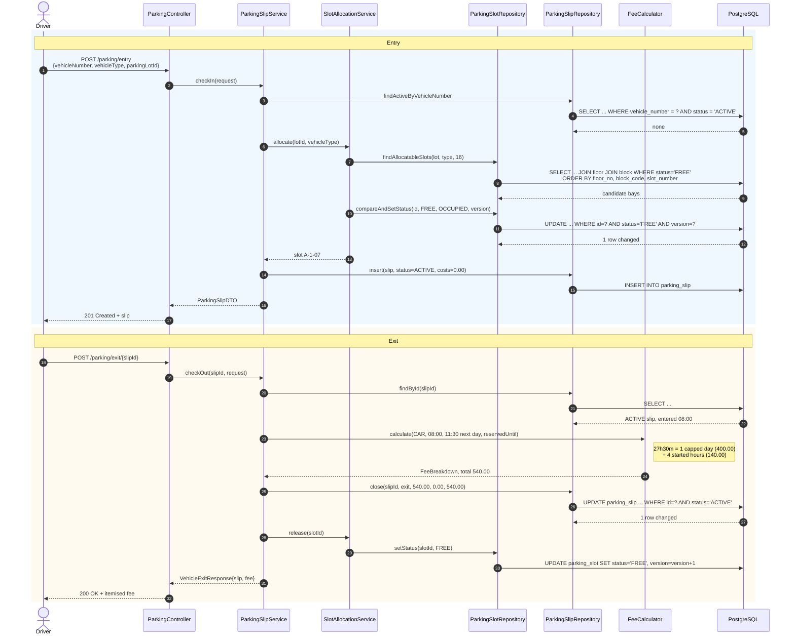

# ParkingLotManagement

[](https://github.com/vivekkumarq/ParkingLotManagement/actions/workflows/ci.yml)
[](https://adoptium.net/)
[](https://spring.io/projects/spring-boot)
[](https://www.jooq.org/)
[](LICENSE)

A REST backend for a multi-block car park. It issues a ticket when a vehicle
arrives, allocates it a bay without ever handing the same bay to two drivers,
prices the stay from a configurable rate card when it leaves, takes reservations
for future windows, and reports on revenue, occupancy and traffic.

Built as a five-module Maven reactor on Spring Boot, with **jOOQ** for typed SQL
and **Flyway** for schema migrations. There is no ORM at run time.

---

## Table of contents

- [What it does](#what-it-does)
- [Architecture](#architecture)
- [Domain model](#domain-model)
- [Slot lifecycle](#slot-lifecycle)
- [A stay, end to end](#a-stay-end-to-end)
- [Modules](#modules)
- [Tech stack](#tech-stack)
- [Getting started](#getting-started)
- [Regenerating the jOOQ classes](#regenerating-the-jooq-classes)
- [API reference](#api-reference)
- [RSQL filtering](#rsql-filtering)
- [Fees and the rate card](#fees-and-the-rate-card)
- [Configuration](#configuration)
- [Testing](#testing)
- [Project structure](#project-structure)
- [Screenshots](#screenshots)
- [Roadmap](#roadmap)
- [Contributing](#contributing)
- [License](#license)

---

## What it does

**Vehicle entry and exit**
- Issue a parking slip on arrival, recording the registration, vehicle type and
  entry time.
- Refuse a second slip for a vehicle that is already inside.
- Close the slip on departure, price the stay and free the bay.
- Check out by slip id or by number plate, for gates that read one or the other.
- Registrations are matched case- and punctuation-insensitively, so `ka 01-ab 1234`
  and `KA01AB1234` are the same vehicle.

**Slot allocation**
- Finds the lowest free bay that fits the vehicle type, ordered by floor, then
  block, then slot number, so a car park fills from the ground up.
- Claims it with a compare-and-set on `(id, status, version)`. Two simultaneous
  arrivals cannot be given the same bay — see [Slot lifecycle](#slot-lifecycle).
- Bays can be withdrawn from service for maintenance, but only while free.

**Billing**
- `BigDecimal` throughout, scaled to two decimals with `HALF_UP`. No `double`
  touches money anywhere in the codebase.
- A free grace period, a first-hour rate, an additional-hour rate and a daily cap
  per vehicle type, all from configuration.
- A penalty per started hour when a reserved stay runs past its window.
- Every charge is returned as an itemised breakdown, not just a total.

**Reservations**
- Book a bay for a future window, either a specific one or whichever the
  allocator picks.
- Windows are half-open, so a booking that ends at 12:00 does not clash with one
  that starts at 12:00, while any real intersection is refused.
- Cancel a booking, or let a background sweep expire it once its window closes
  without the vehicle arriving. Either way the bay is released — unless another
  live booking still needs it.
- Convert a booking into a slip when the vehicle turns up.

**Occupancy and availability**
- Free / reserved / occupied / out-of-service counts per floor, per block and per
  vehicle type.
- A live occupancy summary per car park, with the occupancy rate as a percentage.
- The list of bays that could be allocated right now for a given vehicle type.

**Reporting**
- Revenue over a date range: total, basic vs penalty, average ticket, split by
  vehicle type and broken down by day.
- Stay length: mean, shortest and longest.
- Occupancy sampled over time in buckets of 1–24 hours.
- Arrivals per hour of day, ranked.
- Every report can be scoped to one car park or run across all of them.

**Cross-cutting**
- OpenAPI 3 with Swagger UI at `/swagger-ui.html`.
- RSQL filtering on the list endpoints — see [RSQL filtering](#rsql-filtering).
- One structured error shape for every failure, with a stable machine-readable
  code.
- Bulk-create car parks from an `.xlsx` workbook.
- Bean Validation on every request body.

> Not implemented, and deliberately not claimed: payment capture or refunds
> (fees are calculated and recorded, but no money moves), authentication and
> authorisation, multi-tenancy, and any UI. The API is unauthenticated.

---

## Architecture

Five Maven modules with a strict one-way dependency chain. Contracts live in
`-api`; nothing depends on `-web` or `-application`.



**The request flow**, concretely — `POST /parking-lot-management/parking/entry`:

1. `ParkingController` validates the body (`@Valid`) and calls `ParkingSlipService`.
2. `ParkingSlipServiceImpl` opens a transaction, checks the vehicle is not already
   inside, and asks `SlotAllocationService` for a bay.
3. `SlotAllocationServiceImpl` reads candidate bays through `ParkingSlotRepository`
   and claims one with a guarded `UPDATE`.
4. `ParkingSlipRepository` inserts the slip. Both repositories speak jOOQ against
   the generated `Tables` classes.
5. The controller returns `201` with the slip; anything thrown on the way is
   turned into an `ApiError` by `GlobalExceptionHandler`.

**Why jOOQ and Flyway rather than an ORM.** The schema is the source of truth and
Flyway owns it — every change is a numbered, reviewable migration, and nothing can
alter the database out from under it (Hibernate's auto-configuration is explicitly
excluded at run time). Queries are written as typed Java against classes generated
from the schema, so a renamed column is a compile error rather than a runtime
surprise, and the allocation compare-and-set and the reporting aggregates are
expressed directly instead of being coaxed out of an ORM.

---

## Domain model



Cardinalities worth spelling out:

- A **slot** belongs to exactly one floor, a floor to one block, a block to one
  car park.
- A **slot** may have many reservations over time (non-overlapping windows) and
  many slips over time, but at most one *open* slip.
- A **slip** references a reservation only when the stay came from a booking; a
  walk-in has none. Either way it always names its slot.
- A **customer** is optional on both a slip and a reservation — the car park
  accepts vehicles that are not registered.

`version` on `parking_slot` is the optimistic-lock counter the allocator uses.

---

## Slot lifecycle



Every transition except release is a **compare-and-set**: the `UPDATE` matches on
the slot id, the status the caller observed *and* the version it observed, and the
operation fails if it did not change exactly one row.

```sql
UPDATE parking_slot
   SET status = 'OCCUPIED', version = version + 1
 WHERE id = ? AND status = 'FREE' AND version = ?
```

Two threads racing for the last bay both issue this statement. The database
serialises them on the row lock; the winner changes one row, the loser changes
none, notices, and moves on to the next candidate. No table lock, no
`SELECT ... FOR UPDATE`, and no arrival waiting on an unrelated one. Candidates
are fetched in batches of 16, so a burst of simultaneous arrivals is absorbed
without a second round trip.

The slip has its own, simpler lifecycle:



---

## A stay, end to end



---

## Modules

| Module | Owns | Depends on |
|---|---|---|
| `parkinglotmanagement-api` | The contract: JPA entities (which are also the input to jOOQ code generation), DTOs with Bean Validation and OpenAPI annotations, service interfaces, domain enums (`VehicleType`, `SlotStatus`, `SlipStatus`, `ReservationStatus`), the domain exception hierarchy, and table/column name constants. | — |
| `parkinglotmanagement-database` | Flyway migrations, and nothing else. `V1` created the original tables; `V2` corrects their types and adds everything the parking operations need. Packaged as a jar so any module that needs the schema can put it on its classpath. | — |
| `parkinglotmanagement-impl` | The behaviour: jOOQ repositories, service implementations, the allocation engine, the `FeeCalculator`, the RSQL-to-jOOQ compiler, and the rate-card / clock / jOOQ-settings configuration. The generated jOOQ `Tables` classes are produced here at build time. | `-api`, `-database` |
| `parkinglotmanagement-web` | The HTTP surface: eight `@RestController`s, the `@RestControllerAdvice` that renders every failure as an `ApiError`, and the OpenAPI document definition. | `-api`, `-impl` |
| `parkinglotmanagement-application` | The runnable artefact: `@SpringBootApplication`, profiles, externalised configuration, and the scheduled reservation-expiry sweep. The only module that produces a Spring Boot executable jar. | `-web`, `-database` |

---

## Tech stack

| Layer | Technology | Version | Why |
|---|---|---|---|
| Language | Java | 17 | `java.version` in the root POM. |
| Framework | Spring Boot | 2.6.8 | Web MVC, dependency injection, transactions, configuration binding, Actuator. |
| Build | Maven (wrapper) | 3.9.7 | Multi-module reactor; `./mvnw` needs no local Maven. |
| **SQL** | **jOOQ** | **3.14.15** | Queries are typed Java built from classes generated off the schema, so a renamed column breaks the build rather than production. Needed here for the compare-and-set allocation and the reporting aggregates, which are awkward through an ORM. |
| **Migrations** | **Flyway** | **8.0.5** | The schema is versioned, ordered and reviewable. Applied automatically at start-up and in the tests, so code and schema cannot drift silently. |
| Code generation | `jooq-meta-extensions-hibernate` | 3.14.15 | Derives the jOOQ classes from the JPA entity model in `-api` via a throwaway in-memory H2. **The build never needs a live database.** |
| Database | PostgreSQL | driver 42.3.5 | Production store. |
| Database | H2 | 1.4.200 | `dev` and `test` profiles. The Flyway migrations run on it unchanged. |
| Pooling | HikariCP | 4.0.3 | Auto-configured by Spring Boot from `spring.datasource.hikari.*`. |
| API docs | springdoc-openapi-ui | 1.6.11 | OpenAPI 3 + Swagger UI. The `-ui` artefact, not `starter-webmvc-ui`, because this is Boot 2.x. |
| Filtering | rsql-parser | 2.1.0 | Parses the `search` query parameter; compiled to a jOOQ `Condition`. |
| Spreadsheets | Apache POI | 5.2.3 | `.xlsx` bulk import of car parks. |
| Boilerplate | Lombok | 1.18.30 | Accessors and builders. |
| Tests | JUnit 5 | 5.8.2 | |
| Tests | Mockito | 4.0.0 | Service-layer unit tests. |
| Tests | AssertJ | 3.21.0 | Assertions. |

---

## Getting started

### Prerequisites

- **JDK 17** — `java -version` should report 17. Nothing else is required; the
  Maven wrapper downloads Maven itself.
- **Docker** (optional) — only for the Compose path.
- **PostgreSQL** (optional) — only to run against it rather than H2.

### Build and test

```bash
git clone https://github.com/vivekkumarq/ParkingLotManagement.git
cd ParkingLotManagement

./mvnw -B clean verify
```

That compiles all five modules, generates the jOOQ classes and runs the whole
test suite. It needs no database and no network service.

### Run it — no database required

The `dev` profile uses an in-memory H2 and applies the Flyway migrations to it at
start-up:

```bash
./mvnw -pl parkinglotmanagement-application spring-boot:run \
       -Dspring-boot.run.profiles=dev
```

Or from the jar:

```bash
./mvnw -B clean package
java -jar parkinglotmanagement-application/target/parkinglotmanagement.jar \
     --spring.profiles.active=dev
```

Then open:

| | |
|---|---|
| Swagger UI | <http://localhost:8083/swagger-ui.html> |
| OpenAPI document | <http://localhost:8083/v3/api-docs> |
| Health | <http://localhost:8083/actuator/health> |
| H2 console (`dev` only) | <http://localhost:8083/h2-console> |

### Run it against PostgreSQL

Create the database, then point the application at it. Flyway applies `V1` and
`V2` on first start-up — there is no separate migration step.

```bash
createdb parkinglotmanagement

export DB_URL=jdbc:postgresql://localhost:5432/parkinglotmanagement
export DB_USERNAME=parking
export DB_PASSWORD=parking

./mvnw -pl parkinglotmanagement-application spring-boot:run
```

To apply the migrations without starting the application — for example against a
database you deploy to separately — point Flyway's CLI at the same scripts:

```bash
flyway -url=jdbc:postgresql://localhost:5432/parkinglotmanagement \
       -user=parking -password=parking \
       -locations=filesystem:parkinglotmanagement-database/src/main/resources/db/migration \
       migrate
```

### Run it with Docker Compose

> **Unverified.** Docker was not available in the environment this repository was
> revamped in, so the image and the Compose stack have never been built or
> started. The files are written but untested.

```bash
cp .env.example .env
docker compose up --build
```

This starts PostgreSQL 15 with a named volume and the application on
<http://localhost:8083>. The app waits for the database's `pg_isready`
healthcheck before starting, so the first migration cannot race it.

---

## Regenerating the jOOQ classes

The generated classes live in
`parkinglotmanagement-impl/target/generated-sources/jooq` and are **not**
committed. They are produced during `generate-sources`, so any normal build
refreshes them:

```bash
./mvnw -B -pl parkinglotmanagement-impl generate-sources
```

Generation reads the JPA entity model in
`parkinglotmanagement-api/src/main/java/.../api/entity/`, has Hibernate export it
into a throwaway in-memory H2, and generates from that. **No live database is
involved**, which is why a clean checkout builds on any machine and in CI.

The configuration is
`parkinglotmanagement-impl/src/main/resources/jooqGeneratorConfig.xml`. The
codegen-only dependencies (`jooq-meta-extensions-hibernate`, H2,
`javax.persistence-api`) are declared on the plugin rather than on the module, so
Hibernate never reaches the application's runtime classpath.

**When you change the schema**, change both sides:

1. Add a new `V{n}__Description.sql` under
   `parkinglotmanagement-database/src/main/resources/db/migration/`. Never edit a
   migration that has been applied anywhere.
2. Make the matching change to the JPA entity in `-api`, so the generated jOOQ
   classes describe the new shape.
3. Run `./mvnw clean verify`. `SchemaMigrationTest` applies the real migrations to
   H2 and exercises the repositories against the result, so drift between the two
   fails the build.

Keep V2's portability constraint in mind: the migrations run on both PostgreSQL
and H2, so stick to DDL both accept (`ALTER TABLE ... ADD COLUMN`, `DROP COLUMN`,
`SET NOT NULL`, `SET DEFAULT`, `ADD CONSTRAINT`, `CREATE INDEX`, and plain
`UPDATE` for data moves). `ALTER COLUMN ... TYPE ... USING` is PostgreSQL-only.

---

## API reference

Base path: `/parking-lot-management`. All request and response bodies are JSON.

### Vehicle entry and exit — `/parking`

| Method | Path | Purpose | Success |
|---|---|---|---|
| `POST` | `/parking/entry` | Allocate a bay and issue a slip | `201` |
| `POST` | `/parking/exit/{slipId}` | Close and price a stay | `200` |
| `POST` | `/parking/exit/by-vehicle/{vehicleNumber}` | Same, found by number plate | `200` |
| `GET` | `/parking/slips/{id}` | One slip | `200` |
| `GET` | `/parking/slips/active/{vehicleNumber}` | The open slip for a vehicle | `200` |
| `GET` | `/parking/slips?search=` | List slips, RSQL-filterable | `200` |

<details>
<summary><b>POST /parking/entry</b></summary>

```jsonc
// Request
{
  "vehicleNumber": "KA01AB1234",
  "vehicleType": "CAR",                       // MOTORCYCLE | CAR | TRUCK
  "parkingLotId": "8f14e45f-ceea-467a-9c1e-1b1a1d2c3e4f",
  "customerId": null,                         // optional
  "entryTime": "2026-03-01T08:00:00"          // optional, defaults to now
}
```

```jsonc
// 201 Created
{
  "id": "3c6e0b8a-9c15-4f6b-a1d2-7e9f0a1b2c3d",
  "parkingSlotReservationId": null,
  "parkingSlotId": "b1946ac9-2492-4c8f-9d1e-5a6b7c8d9e0f",
  "customerId": null,
  "vehicleNumber": "KA01AB1234",
  "vehicleType": "CAR",
  "actualEntryTime": "2026-03-01T08:00:00",
  "actualExitTime": null,
  "basicCost": 0.00,
  "penalty": 0.00,
  "totalCost": 0.00,
  "status": "ACTIVE",
  "@type": "ParkingSlip"
}
```

`409 NO_SLOT_AVAILABLE` when the car park is full for that vehicle type;
`409 DUPLICATE_ENTRY` when the vehicle already has an open slip.
</details>

<details>
<summary><b>POST /parking/exit/{slipId}</b></summary>

```jsonc
// Request — optional; omit the body entirely to use the server clock
{ "exitTime": "2026-03-02T11:30:00" }
```

```jsonc
// 200 OK
{
  "slip": {
    "id": "3c6e0b8a-9c15-4f6b-a1d2-7e9f0a1b2c3d",
    "vehicleNumber": "KA01AB1234",
    "vehicleType": "CAR",
    "actualEntryTime": "2026-03-01T08:00:00",
    "actualExitTime": "2026-03-02T11:30:00",
    "basicCost": 540.00,
    "penalty": 0.00,
    "totalCost": 540.00,
    "status": "CLOSED",
    "@type": "ParkingSlip"
  },
  "fee": {
    "vehicleType": "CAR",
    "durationMinutes": 1650,
    "withinGracePeriod": false,
    "chargedDays": 1,
    "chargedHours": 4,
    "dayCharges": 400.00,
    "hourCharges": 140.00,
    "basicCost": 540.00,
    "penalty": 0.00,
    "totalCost": 540.00,
    "currency": "INR"
  }
}
```

`404` when the slip does not exist; `400` when it is already closed or the exit
precedes the entry.
</details>

### Slots and availability — `/slots`

| Method | Path | Purpose | Success |
|---|---|---|---|
| `POST` | `/slots` | Create a bay | `201` |
| `GET` | `/slots/{id}` | One bay | `200` |
| `GET` | `/slots?search=` | List bays, RSQL-filterable | `200` |
| `PUT` | `/slots/{id}` | Update a bay's description | `200` |
| `PATCH` | `/slots/{id}/out-of-service?value=true` | Withdraw or restore a bay | `200` |
| `DELETE` | `/slots/{id}` | Delete a bay | `204` |
| `GET` | `/slots/availability/{parkingLotId}/by-floor` | Counts per floor | `200` |
| `GET` | `/slots/availability/{parkingLotId}/by-block` | Counts per block | `200` |
| `GET` | `/slots/availability/{parkingLotId}/by-vehicle-type` | Counts per vehicle type | `200` |
| `GET` | `/slots/availability/{parkingLotId}/free?vehicleType=CAR` | Allocatable bays right now | `200` |
| `GET` | `/slots/occupancy/{parkingLotId}` | Live occupancy summary | `200` |

<details>
<summary><b>GET /slots/occupancy/{parkingLotId}</b></summary>

```jsonc
// 200 OK
{
  "parkingLotId": "8f14e45f-ceea-467a-9c1e-1b1a1d2c3e4f",
  "asOf": "2026-03-01T12:00:00",
  "totalSlots": 150,
  "occupiedSlots": 98,
  "reservedSlots": 9,
  "freeSlots": 43,
  "occupancyRate": 65.33,
  "activeSlips": 98,
  "byVehicleType": [
    { "vehicleType": "CAR",        "freeSlots": 30, "reservedSlots": 7, "occupiedSlots": 80, "outOfServiceSlots": 0, "totalSlots": 117 },
    { "vehicleType": "MOTORCYCLE", "freeSlots": 13, "reservedSlots": 2, "occupiedSlots": 18, "outOfServiceSlots": 0, "totalSlots": 33 }
  ]
}
```
</details>

### Reservations — `/reservations`

| Method | Path | Purpose | Success |
|---|---|---|---|
| `POST` | `/reservations` | Book a bay for a window | `201` |
| `GET` | `/reservations/{id}` | One booking | `200` |
| `GET` | `/reservations?search=` | List bookings, RSQL-filterable | `200` |
| `POST` | `/reservations/{id}/claim?arrivalTime=` | Turn a booking into a slip | `201` |
| `DELETE` | `/reservations/{id}` | Cancel and release the bay | `200` |
| `POST` | `/reservations/expire?asOf=` | Sweep unclaimed bookings | `200` |

<details>
<summary><b>POST /reservations</b></summary>

```jsonc
// Request
{
  "vehicleNumber": "KA01AB1234",
  "vehicleType": "CAR",
  "parkingLotId": "8f14e45f-ceea-467a-9c1e-1b1a1d2c3e4f",
  "parkingSlotId": null,          // optional — omit to let the allocator choose
  "customerId": null,             // optional
  "startTimestamp": "2026-09-01T09:00:00",
  "durationInHours": 3            // 1..720
}
```

```jsonc
// 201 Created
{
  "id": "d1e2f3a4-b5c6-4778-8899-aabbccddeeff",
  "customerId": null,
  "parkingSlotId": "b1946ac9-2492-4c8f-9d1e-5a6b7c8d9e0f",
  "vehicleNumber": "KA01AB1234",
  "startTimestamp": "2026-09-01T09:00:00",
  "endTimestamp": "2026-09-01T12:00:00",
  "durationInHours": 3,
  "bookingDate": "2026-08-29",
  "status": "BOOKED",
  "createdAt": "2026-08-29T10:00:00",
  "@type": "Reservation"
}
```

`409 RESERVATION_CONFLICT` when the requested bay is already booked for an
overlapping window; `409 NO_SLOT_AVAILABLE` when no bay is free and none was
named; `400` when the window starts in the past.
</details>

<details>
<summary><b>POST /reservations/expire</b></summary>

```
POST /parking-lot-management/reservations/expire?asOf=2026-09-01T13:00:00
```

```jsonc
// 200 OK
{ "expired": 4 }
```

Idempotent — it only moves `BOOKED` bookings whose window has already closed, so
running it twice is harmless. A scheduled sweep does the same thing every five
minutes by default.
</details>

### Reporting — `/reports`

Every endpoint takes `from` and `to` as ISO date-times and an optional
`parkingLotId`. Ranges are half-open: `[from, to)`.

| Method | Path | Purpose |
|---|---|---|
| `GET` | `/reports/revenue?parkingLotId=&from=&to=` | Takings, split by type and by day |
| `GET` | `/reports/duration?parkingLotId=&from=&to=` | Mean, shortest and longest stay |
| `GET` | `/reports/occupancy?parkingLotId=&from=&to=&bucketHours=1` | Occupancy sampled over time |
| `GET` | `/reports/peak-hours?parkingLotId=&from=&to=` | Arrivals per hour of day, busiest first |

<details>
<summary><b>GET /reports/revenue</b></summary>

```
GET /parking-lot-management/reports/revenue
    ?from=2026-03-01T00:00:00&to=2026-03-08T00:00:00
```

```jsonc
// 200 OK
{
  "from": "2026-03-01T00:00:00",
  "to": "2026-03-08T00:00:00",
  "closedSlips": 412,
  "basicRevenue": 184320.00,
  "penaltyRevenue": 2400.00,
  "totalRevenue": 186720.00,
  "averageTicket": 453.20,
  "revenueByVehicleType": { "CAR": 152000.00, "MOTORCYCLE": 18720.00, "TRUCK": 16000.00 },
  "daily": [
    { "date": "2026-03-01", "closedSlips": 37, "totalRevenue": 16780.00 }
  ],
  "currency": "INR"
}
```
</details>

<details>
<summary><b>GET /reports/occupancy</b></summary>

```
GET /parking-lot-management/reports/occupancy
    ?parkingLotId=8f14e45f-ceea-467a-9c1e-1b1a1d2c3e4f
    &from=2026-03-01T08:00:00&to=2026-03-01T11:00:00&bucketHours=1
```

```jsonc
// 200 OK
[
  { "bucketStart": "2026-03-01T08:00:00", "occupiedSlots": 41, "totalSlots": 150, "occupancyRate": 27.33 },
  { "bucketStart": "2026-03-01T09:00:00", "occupiedSlots": 96, "totalSlots": 150, "occupancyRate": 64.00 },
  { "bucketStart": "2026-03-01T10:00:00", "occupiedSlots": 118, "totalSlots": 150, "occupancyRate": 78.67 }
]
```

`occupancyRate` is only computed when a `parkingLotId` is given — without one
there is no meaningful denominator, and the field is `null`.
</details>

### Structure and customers

| Method | Path | Purpose | Success |
|---|---|---|---|
| `POST` | `/parkingLot/create-parkingLot` | Create a car park | `201` |
| `GET` | `/parkingLot/{id}` | One car park | `200` |
| `GET` | `/parkingLot` | List car parks | `200` |
| `PUT` | `/parkingLot/{id}` | Update | `200` |
| `DELETE` | `/parkingLot/{id}` | Delete | `204` |
| `POST` | `/parkingLot/upload-parkingLots` | Bulk create from `.xlsx` (multipart `file`) | `201` |
| `POST` | `/blocks/create-blocks` | Create a block | `201` |
| `GET` | `/blocks` | List blocks | `200` |
| `GET` | `/blocks/{blockId}/{parkingLotId}` | One block within a car park | `200` |
| `PUT` | `/blocks/{blockId}` | Update | `200` |
| `DELETE` | `/blocks/{blockId}/{parkingLotId}` | Delete | `204` |
| `POST` | `/floors/create-floors` | Create a floor | `201` |
| `GET` | `/floors/{id}` | One floor | `200` |
| `GET` | `/floors` | List floors | `200` |
| `PUT` | `/floors/{id}` | Update | `200` |
| `DELETE` | `/floors/{id}` | Delete | `204` |
| `POST` | `/customer/create-customer` | Register a customer | `201` |
| `GET` | `/customer/{id}` | One customer | `200` |
| `GET` | `/customer?search=` | List customers, RSQL-filterable | `200` |
| `PUT` | `/customer/{id}` | Update | `200` |
| `DELETE` | `/customer/{id}` | Delete | `204` |

<details>
<summary><b>POST /parkingLot/create-parkingLot</b></summary>

```jsonc
// Request
{
  "numberOfBlocks": 3,
  "address": "12 MG Road, Bengaluru 560001",
  "longitude": 77.5946,
  "latitude": 12.9716
}
```

```jsonc
// 201 Created
{
  "id": "8f14e45f-ceea-467a-9c1e-1b1a1d2c3e4f",
  "numberOfBlocks": 3,
  "address": "12 MG Road, Bengaluru 560001",
  "longitude": 77.5946,
  "latitude": 12.9716,
  "@type": "ParkingLot"
}
```
</details>

The `.xlsx` upload expects a header row followed by
`numberOfBlocks | address | longitude | latitude`. The whole file is parsed and
validated before anything is written, so a bad row on line 40 does not leave 39
car parks half-imported; the error names the row.

### Errors

Every failure — validation, domain, or unexpected — returns the same shape:

```jsonc
// 409 Conflict
{
  "timestamp": "2026-08-29T13:45:12.318",
  "status": 409,
  "error": "Conflict",
  "code": "NO_SLOT_AVAILABLE",
  "message": "No free slot is available for vehicle type TRUCK",
  "path": "/parking-lot-management/parking/entry"
}
```

```jsonc
// 400 Bad Request — validation
{
  "timestamp": "2026-08-29T13:46:02.771",
  "status": 400,
  "error": "Bad Request",
  "code": "VALIDATION_FAILED",
  "message": "Request validation failed",
  "path": "/parking-lot-management/parking/entry",
  "violations": [
    { "field": "vehicleNumber", "message": "must not be blank" },
    { "field": "vehicleType",   "message": "must not be null" }
  ]
}
```

| Code | Status | Meaning |
|---|---|---|
| `VALIDATION_FAILED` | 400 | A field failed Bean Validation, or a parameter was missing or malformed. |
| `INVALID_REQUEST` | 400 | Well-formed but semantically wrong — a closed slip, an inverted range, an unknown filter field. |
| `RESOURCE_NOT_FOUND` | 404 | No such record. |
| `NO_SLOT_AVAILABLE` | 409 | The car park is full for that vehicle type. |
| `SLOT_UNAVAILABLE` | 409 | The bay is not in a state the operation allows, or it changed under us. |
| `RESERVATION_CONFLICT` | 409 | The window overlaps an existing booking. |
| `DUPLICATE_ENTRY` | 409 | The vehicle already has an open slip. |
| `INTERNAL_ERROR` | 500 | Unexpected. Logged in full server-side; the response deliberately carries no detail. |

---

## RSQL filtering

List endpoints accept an optional `search` parameter written in
[RSQL](https://github.com/jirutka/rsql-parser). It is compiled to a jOOQ
`Condition` and pushed into the SQL — values become bind parameters, and field
names are resolved through a per-endpoint whitelist, so an unknown field is a
`400` rather than something interpolated into a query.

| Operator | Meaning | Example |
|---|---|---|
| `==` | equal | `status==ACTIVE` |
| `!=` | not equal | `vehicleType!=TRUCK` |
| `=gt=` | greater than | `totalCost=gt=500` |
| `=ge=` | greater than or equal | `durationInHours=ge=2` |
| `=lt=` | less than | `totalCost=lt=100` |
| `=le=` | less than or equal | `durationInHours=le=4` |
| `=in=` | in a set | `status=in=(ACTIVE,CLOSED)` |
| `=out=` | not in a set | `vehicleType=out=(TRUCK)` |
| `;` | and | `status==ACTIVE;vehicleType==CAR` |
| `,` | or | `status==BOOKED,status==CLAIMED` |
| `*` | wildcard, text fields only | `email==*@example.com` |
| `( )` | grouping | `(name==Asha,name==Ravi);totalCost=gt=100` |

Real examples:

```bash
# Cars currently inside
GET /parking-lot-management/parking/slips?search=status==ACTIVE;vehicleType==CAR

# Closed stays that cost more than 500
GET /parking-lot-management/parking/slips?search=status==CLOSED;totalCost=gt=500

# Free car bays on a specific floor
GET /parking-lot-management/slots?search=status==FREE;vehicleType==CAR;floorId==b1946ac9-2492-4c8f-9d1e-5a6b7c8d9e0f

# Live bookings of two hours or more
GET /parking-lot-management/reservations?search=status==BOOKED;durationInHours=ge=2

# Customers on a corporate domain whose name starts with A
GET /parking-lot-management/customer?search=name==A*;email==*@example.com

# Motorcycles or trucks, either way
GET /parking-lot-management/slots?search=vehicleType==MOTORCYCLE,vehicleType==TRUCK
```

Filterable fields per endpoint:

| Endpoint | Fields |
|---|---|
| `/customer` | `id`, `vehicleNumber`, `contactNumber`, `name`, `email` |
| `/slots` | `id`, `floorId`, `slotNumber`, `charges`, `vehicleType`, `status` |
| `/parking/slips` | `id`, `parkingSlotId`, `customerId`, `vehicleNumber`, `vehicleType`, `status`, `basicCost`, `totalCost`, `actualEntryTime`, `actualExitTime` |
| `/reservations` | `id`, `customerId`, `parkingSlotId`, `vehicleNumber`, `status`, `durationInHours`, `startTimestamp`, `endTimestamp`, `bookingDate` |

Comparisons are typed: `totalCost=gt=500` is arithmetic, not a string comparison,
because each value is converted through its column's own data type. A value that
cannot be converted is a `400`.

---

## Fees and the rate card

The tariff is configuration, not code. Shipped defaults:

| Vehicle type | First chargeable hour | Each additional hour | Daily cap |
|---|---|---|---|
| `MOTORCYCLE` | 20.00 | 10.00 | 100.00 |
| `CAR` | 50.00 | 30.00 | 400.00 |
| `TRUCK` | 100.00 | 60.00 | 800.00 |

Plus a **15-minute grace period** and a **50.00 per started hour** overstay
penalty. Currency is a label (`INR` by default) carried through to the responses.

### The rules

1. A stay no longer than the grace period is **free**.
2. Past it, each **complete 24-hour period** is billed at the daily cap.
3. The **part-day remainder** is rounded *up* to whole hours and billed as
   `firstHour + (hours − 1) × additionalHour`, then capped at the daily cap — so a
   23-hour remainder never costs more than a full day.
4. A stay that ran past a **reserved window** pays the overstay penalty for each
   started hour beyond it.
5. `totalCost = basicCost + penalty`, scaled to 2 decimals with `HALF_UP`.

### Worked example

A car enters at **08:00 on 1 March** and leaves at **11:30 on 2 March**.

| Step | Working | Amount |
|---|---|---|
| Duration | 27 h 30 m = **1650 minutes** | |
| Past the 15-minute grace period? | 1650 > 15 → yes, chargeable | |
| Complete days | 1650 ÷ 1440 = **1 day** → 1 × 400.00 | **400.00** |
| Remainder | 1650 − 1440 = 210 min = 3 h 30 m → rounded up to **4 hours** | |
| Remainder charge | 50.00 + (4 − 1) × 30.00 = 50.00 + 90.00 | 140.00 |
| Capped at the daily rate? | min(140.00, 400.00) = 140.00 | **140.00** |
| Basic cost | 400.00 + 140.00 | **540.00** |
| Penalty | walk-in, no reserved window | **0.00** |
| **Total** | 540.00 + 0.00 | **540.00** |

A few more, for the same car:

| Stay | Charged | Why |
|---|---|---|
| 15 min | 0.00 | Exactly at the grace boundary |
| 16 min | 50.00 | Any started hour past grace is a full first hour |
| 60 min | 50.00 | Exactly one hour |
| 61 min | 80.00 | Rolls into the second hour: 50 + 30 |
| 10 h | 320.00 | 50 + 9 × 30 |
| 13 h | 400.00 | 50 + 12 × 30 = 410, capped at the daily 400 |
| 24 h | 400.00 | One complete day, no remainder |
| 25 h | 450.00 | One capped day + one first hour |
| 3 days | 1200.00 | 3 × 400 |

Every row above is asserted in `FeeCalculatorTest`. Change any of it without
touching code — see the `RATE_*` variables in [Configuration](#configuration).

---

## Configuration

Every setting reads an environment variable with a working default, so the same
jar runs locally and in a container. `.env.example` documents them all.

### Profiles

| Profile | Database | Use |
|---|---|---|
| *(default)* | PostgreSQL via `DB_URL` | Production and any real deployment. |
| `dev` | In-memory H2, H2 console on | Local development with nothing installed. |
| `test` | In-memory H2, expiry sweep off | Automated tests. |

### Environment variables

| Variable | Default | What it does |
|---|---|---|
| `SERVER_PORT` | `8083` | HTTP port. |
| `DB_URL` | `jdbc:postgresql://localhost:5432/parkinglotmanagement` | JDBC URL. |
| `DB_USERNAME` | `parking` | Database user. |
| `DB_PASSWORD` | `parking` | Database password. |
| `DB_DRIVER` | `org.postgresql.Driver` | JDBC driver class. |
| `DB_POOL_MAX` | `10` | Hikari maximum pool size. |
| `DB_POOL_MIN` | `2` | Hikari minimum idle connections. |
| `DB_CONNECTION_TIMEOUT_MS` | `30000` | Hikari connection timeout. |
| `FLYWAY_ENABLED` | `true` | Apply migrations at start-up. |
| `FLYWAY_BASELINE_ON_MIGRATE` | `true` | Let Flyway adopt a database that already has the V1 tables. |
| `JOOQ_DIALECT` | `Postgres` | Must match the database — `Postgres` or `H2`. |
| `RATE_CURRENCY` | `INR` | Currency label in fee and revenue responses. |
| `RATE_GRACE_MINUTES` | `15` | A stay no longer than this is free. |
| `RATE_OVERSTAY_PER_HOUR` | `50.00` | Penalty per started hour past a reserved window. |
| `RATE_MOTORCYCLE_FIRST_HOUR` | `20.00` | First chargeable hour, motorcycle. |
| `RATE_MOTORCYCLE_ADDITIONAL_HOUR` | `10.00` | Each hour after the first. |
| `RATE_MOTORCYCLE_DAILY_CAP` | `100.00` | Ceiling per 24 hours. |
| `RATE_CAR_FIRST_HOUR` | `50.00` | First chargeable hour, car. |
| `RATE_CAR_ADDITIONAL_HOUR` | `30.00` | Each hour after the first. |
| `RATE_CAR_DAILY_CAP` | `400.00` | Ceiling per 24 hours. |
| `RATE_TRUCK_FIRST_HOUR` | `100.00` | First chargeable hour, truck. |
| `RATE_TRUCK_ADDITIONAL_HOUR` | `60.00` | Each hour after the first. |
| `RATE_TRUCK_DAILY_CAP` | `800.00` | Ceiling per 24 hours. |
| `RESERVATION_EXPIRY_ENABLED` | `true` | Run the background sweep that releases unclaimed bookings. |
| `RESERVATION_EXPIRY_INTERVAL_MS` | `300000` | How often the sweep runs. |
| `RESERVATION_EXPIRY_INITIAL_DELAY_MS` | `60000` | Delay before the first sweep. |
| `SPRINGDOC_ENABLED` | `true` | Serve Swagger UI and `/v3/api-docs`. |
| `ACTUATOR_ENDPOINTS` | `health,info` | Actuator endpoints to expose. |
| `ACTUATOR_HEALTH_DETAILS` | `never` | `never` · `when-authorized` · `always`. |
| `MAX_UPLOAD_SIZE` | `5MB` | Cap for the `.xlsx` bulk upload. |

Compose additionally reads `POSTGRES_DB`, `POSTGRES_USER`, `POSTGRES_PASSWORD`,
`POSTGRES_PORT` and `APP_PORT` for the database container and the port mapping.

---

## Testing

```bash
./mvnw -B clean verify                       # everything
./mvnw -B test -pl parkinglotmanagement-impl # just the service layer
```

**241 tests, no external dependencies.** The integration tests run against an
in-memory H2 with the real Flyway migrations applied, so a clean checkout tests
green on any machine and in CI without Docker, a database or Testcontainers.

| Suite | Tests | What it pins down |
|---|---|---|
| `FeeCalculatorTest` | 40 | The grace boundary at 0/15/16 minutes, hour rounding, the daily cap on whole and part days, multi-day stays, every vehicle type, `HALF_UP` rounding and 2-decimal scale on every money field, overstay penalties, and every rejected input. |
| `SlotAllocationServiceImplTest` | 11 | The compare-and-set protocol in isolation: the observed version is what gets written, a lost race falls through to the next candidate, contention gives up after a bounded number of rounds. |
| `SlotAllocationConcurrencyTest` | 7 | The same protocol against a real database. Sixteen threads and one bay: exactly one winner, version bumped exactly once. Sixteen threads and six bays: six winners, no bay twice. |
| `ReservationServiceIntegrationTest` | 20 | Overlap, containment and enclosure refused; adjacent windows accepted on both sides; cancellation, claiming, expiry, and expiry not stealing a bay a later booking holds. |
| `ParkingFlowIntegrationTest` | 16 | Entry to exit end to end, with the money asserted against the rate card. |
| `ReportingServiceIntegrationTest` | 12 | Revenue, the daily breakdown, half-open range boundaries, lot scoping, stay lengths, occupancy buckets, peak hours. |
| `CustomRsqlVisitorTest` | 17 | Every operator, plus the two safety properties: values are bind parameters, unknown selectors are rejected. |
| `CrudServiceTest` | 28 | The pre-existing services. |
| `SchemaMigrationTest` | 5 | The Flyway migrations applied to H2 produce the schema the generated jOOQ classes expect. |
| `ParkingControllerTest` | 17 | Entry, exit and the whole error surface through MockMvc. |
| `ParkingSlotControllerTest` | 14 | CRUD, out-of-service transitions, the four availability views. |
| `ReservationControllerTest` | 12 | Booking, claiming, cancelling, the expiry sweep, validation bounds. |
| `ReportingControllerTest` | 8 | All four reports and their parameters. |
| `StructureControllerTest` | 26 | The pre-existing controllers, including a round trip through the `.xlsx` upload with a real workbook. |
| `ApplicationSmokeTest` | 8 | The whole application boots on `test`: every service resolves, jOOQ is wired, no `EntityManagerFactory` exists, all seven tables are queryable, the rate card is bound, health answers, the OpenAPI document lists the new endpoints. |

---

## Project structure

```
ParkingLotManagement/
├── .github/workflows/ci.yml            Reactor build and tests on JDK 17
├── Dockerfile                          Multi-stage build, non-root, healthcheck
├── docker-compose.yml                  App + PostgreSQL 15 + named volume
├── .env.example                        Every environment variable, documented
├── pom.xml                             Reactor: versions, plugin management
│
├── parkinglotmanagement-api/
│   └── src/main/java/.../api/
│       ├── consts/                     Table and column name constants
│       ├── domain/                     VehicleType, SlotStatus, SlipStatus, ReservationStatus
│       ├── dto/                        Request, response and report DTOs
│       ├── entity/                     JPA entities — the jOOQ codegen input
│       ├── exception/                  ParkingLotException and its subtypes
│       └── service/                    Service interfaces
│
├── parkinglotmanagement-database/
│   └── src/main/resources/db/migration/
│       ├── V1__Create_Parking_Lot_Management_Tables.sql
│       └── V2__Parking_Operations_And_Schema_Fixes.sql
│
├── parkinglotmanagement-impl/
│   ├── src/main/java/.../
│   │   ├── config/                     Rate card, Clock, jOOQ Settings
│   │   └── service/
│   │       ├── fee/FeeCalculator.java
│   │       ├── repository/             jOOQ repositories
│   │       ├── rsql/                   RSQL → jOOQ Condition
│   │       └── serviceImpl/            Service implementations
│   ├── src/main/resources/jooqGeneratorConfig.xml
│   └── src/test/java/                  Unit + H2 integration tests
│
├── parkinglotmanagement-web/
│   └── src/main/java/.../web/
│       ├── config/OpenApiConfiguration.java
│       ├── controller/                 Eight @RestControllers
│       └── error/                      ApiError, GlobalExceptionHandler
│
├── parkinglotmanagement-application/
│   └── src/main/
│       ├── java/.../                   Entry point, expiry scheduler
│       └── resources/                  application[-dev|-test].properties
│
└── docs/screenshots/                   Placeholder for screenshots
```

---

## Screenshots

Placeholders — drop images into `docs/screenshots/` under these names and they
will render here.

| View | File |
|---|---|
| **Swagger UI** — the full API surface | `docs/screenshots/swagger-ui.png` |
| **Vehicle entry** — a slip being issued | `docs/screenshots/vehicle-entry.png` |
| **Fee breakdown** — an itemised exit | `docs/screenshots/fee-breakdown.png` |
| **Occupancy** — live availability | `docs/screenshots/occupancy.png` |
| **Revenue report** — takings over a range | `docs/screenshots/revenue-report.png` |

---

## Roadmap

- Authentication and authorisation — the API is currently unauthenticated.
- Payment capture. Fees are calculated and recorded; no money moves.
- Pagination on the list endpoints; they currently return every matching row.
- Pricing that varies by time of day and day of week.
- Notifying a customer before their reservation expires.
- Per-lot rate cards, rather than one tariff for the whole deployment.
- Optimistic-lock retry metrics, exposed through Actuator.

---

## Contributing

See [CONTRIBUTING.md](CONTRIBUTING.md).

---

## License

[MIT](LICENSE) © 2026 Vivek Kumar
